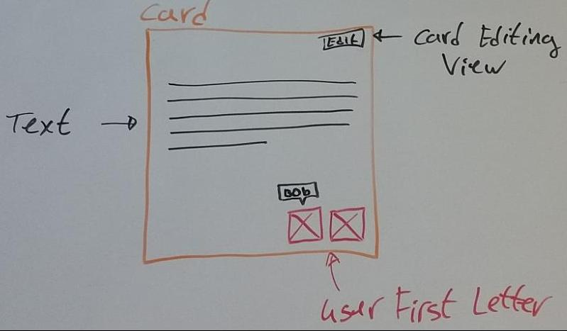
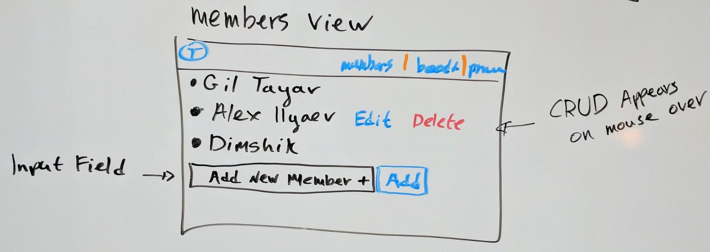

Taskboard Specification
=======================

The Taskboard is a [Trello](https://trello.com/)-like application, which enables the user to create **tasks**
(also called **cards**) and move them between **lists** (also called **columns**).

This document is a specification of how the Taskboard app should look and behave.

Overview
--------

There are two views, which are navigable using the menu:

The two views are:

1. Boards: the main view, which shows a board, with its lists and tasks
1. Members: the list of the members of the Boards

Board Components
----------------

A list of all components that will be shown in the Boards view.

### List

* Each list can’t be more than screen height.
* If there are more lists than what can fit the screen - use horizontal scrolling
  (see [video](spec-assets/videos/scrollable-lists-horizontal.mp4)).
* The title of the list and the footer (**Add card** button) are fixed to the top and bottom
  (see [video](spec-assets/videos/lists-in-action.mp4)).
* If the content of the list exceeds its height, a vertical scroll will be added
  (see [video](spec-assets/videos/task-cards-in-list.mp4)).
* List name will be edited in place.
  * A Click on the name will replace it with an input field.
  * The input field will contain the list name.
  * The user will be able to change the name.
  * On blur or Enter
    * The name will be **saved**.
    * The input field will disappear and switch back to the static list name.
* Clicking on **Add new list** will add a list at the end, with the name “New List”.
* A sub menu will be available on click on the arrow button.
  * The sub menu will hold a **Delete** button.
  * When the **Delete** button is clicked, a prompt will pop and ask the user if he is sure.  
    “**Deleting TODO list. Are you sure?**”
  * If the user agrees, the list will be deleted. Otherwise, cancel the action.

### Task (Card)

A list is a set of cards, where each card contains:

* A description
* A list of icons with the members that are assigned to the card,
  where each icon is actually the uppercase first letter of their name.
* A button **edit** will appear on mouse over on the whole card.
  * Clicking it will open the “Card Edit” modal (outline below)

### Card Edit Modal

* Will appear when the user clicks on **Add card** in the list or
  when the user clicks on **edit** in the card component.
* The “Card Edit” is a modal, meaning, once opened, disallow anything else to be done
  until “Cancel” or “Save” are clicked.
* The “Text” field will show the description of the card
  (with the current text of the card shown initially), and enable editing.
* The **Move to** field is a combo with a list of all the lists,
  with the current list of the card shown as the initial value.
* The **Delete card** button, when clicked, will delete the card from the list.
* The **Cancel** button will hide the modal, and do nothing.
* The **Save** button will update the card with the new data.  
  - If the list that the card is in was updated, it will be removed from the original list,
  and added at the end of the target list.
* When adding a new card with “Add card”, the “Delete card” button is not visible, and the “Save” button should say “Add”.
* The **Members** list contains all available members with a checkbox next to each member.  
  - The checkbox represents if the user was added to this card or not.

Member Components
-----------------

A list of all the components that will be shown in the Members view.

### Members list

* This view contains all members of the task board.
* It should appear as a different “page” (no page reload).
* Should present a list of members.
* On mouse over on one of the names, two buttons will appear to the right of that name.
  * **Edit** button and **Delete** button.
* Click on the Edit button will let the user edit the member name in place.
  * The name will be replaced with an input field.
  * The input field will contain the member name.
  * The user will be able to change the name.
  * While editing, a different set of buttons will be to the right of the input field:
    * **Save** button and **Cancel** button.
    * When the **Save** button is clicked, the input field is removed and the new name appears instead.
    * When **Cancel** button is clicked, the input field is removed and the old name is left without change.
* When the **Delete** button is clicked, a prompt will pop and ask the user if they are sure.  
  “**Deleting member ‘Bob’. Are you sure?**”
